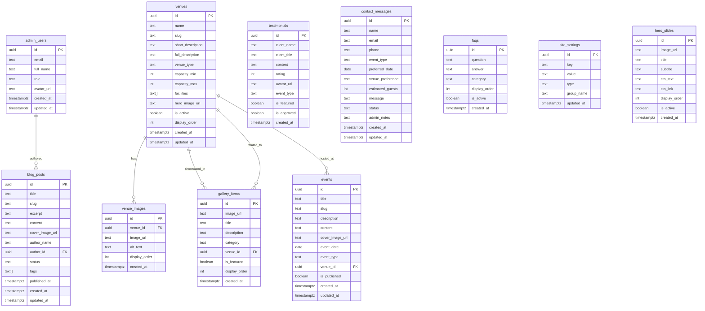

# 📋 Product Requirements Document (PRD)
# Website Kebon Gede Venue

---

## 1. Ringkasan Proyek

| Field | Detail |
|---|---|
| **Nama Proyek** | Website Kebon Gede Venue |
| **Tagline** | *Best Venue for Your Event* |
| **Jenis** | Company Profile + CMS Admin Dashboard |
| **Klien** | Kebon Gede Venue, Palembang |
| **Alamat** | Jl. Sultan Moh. Mansyur No.687, Palembang 30134 |
| **Target Peluncuran** | Q4 2026 |

### 1.1 Deskripsi Bisnis

Kebon Gede Venue adalah venue premium di Palembang yang menyediakan layanan venue outdoor & indoor untuk berbagai jenis acara: **Wedding, Meeting, Outbound, Graduation, Gathering, Birthday Party, Yoga, Work Out**, dan aktivitas lainnya. Venue ini memiliki luas mencapai **1 hektar** dengan pemandangan alam hijau dan fasilitas modern.

### 1.2 Tujuan Website

1. **Meningkatkan brand awareness** dan citra profesional Kebon Gede Venue secara digital
2. **Menjadi media informasi** lengkap bagi calon pelanggan (venue, fasilitas, galeri, kontak)
3. **Menyediakan sistem CMS** bagi admin untuk mengelola konten website secara mandiri
4. **Memfasilitasi interaksi** calon pelanggan melalui form kontak/booking inquiry
5. **Menampilkan portofolio** event yang pernah diselenggarakan sebagai social proof

---

## 2. Tech Stack

| Layer | Teknologi | Versi | Keterangan |
|---|---|---|---|
| **Framework** | Next.js (App Router) | Latest (v16.x) | React Server Components, file-based routing |
| **Styling** | Tailwind CSS | Latest (v4.x) | Utility-first CSS framework |
| **UI Components** | shadcn/ui | Latest | Accessible, customizable component library |
| **Database** | PostgreSQL | Latest | Via Supabase hosted Postgres |
| **Backend/BaaS** | Supabase | Latest | Auth, Database, Storage, Real-time |
| **Language** | TypeScript | Latest (v5.x) | Type safety across the project |
| **Deployment** | Vercel | - | Optimized untuk Next.js |
| **Package Manager** | pnpm / npm | Latest | - |

### 2.1 Arsitektur Aplikasi

```
┌─────────────────────────────────────────────────┐
│                   FRONTEND                       │
│            Next.js App Router (v16)              │
│  ┌─────────────────┐  ┌──────────────────────┐  │
│  │  Public Pages    │  │   Admin Dashboard    │  │
│  │  (SSR/SSG)       │  │   (Protected/CSR)    │  │
│  │  - Home          │  │   - /admin/login     │  │
│  │  - Venues        │  │   - /admin/dashboard │  │
│  │  - Gallery       │  │   - /admin/venues    │  │
│  │  - About         │  │   - /admin/gallery   │  │
│  │  - Contact       │  │   - /admin/events    │  │
│  │  - Events        │  │   - /admin/messages  │  │
│  │  - Blog          │  │   - /admin/blog      │  │
│  └─────────────────┘  │   - /admin/settings   │  │
│                        └──────────────────────┘  │
│         Tailwind CSS + shadcn/ui                 │
└────────────────────┬────────────────────────────┘
                     │
                     │ API Routes / Server Actions
                     │
┌────────────────────▼────────────────────────────┐
│                  SUPABASE                        │
│  ┌──────────┐ ┌──────────┐ ┌──────────────────┐ │
│  │   Auth   │ │ Database │ │    Storage       │ │
│  │  (Admin) │ │ (Postgres)│ │  (Images/Files) │ │
│  └──────────┘ └──────────┘ └──────────────────┘ │
│           Row Level Security (RLS)               │
└─────────────────────────────────────────────────┘
```

### 2.2 Setup Commands

```bash
# Inisialisasi project Next.js dengan shadcn/ui
npx shadcn@latest init -t next

# Install Supabase client
npm install @supabase/supabase-js @supabase/ssr

# Install tambahan
npm install lucide-react framer-motion react-hook-form @hookform/resolvers zod
npm install embla-carousel-react date-fns
```

### 2.3 Environment Variables

```env
NEXT_PUBLIC_SUPABASE_URL=your-project-url
NEXT_PUBLIC_SUPABASE_PUBLISHABLE_KEY=sb_publishable_...
SUPABASE_SERVICE_ROLE_KEY=your-service-role-key
NEXT_PUBLIC_SITE_URL=https://kebongede.com
```

---

## 3. Identitas Brand & Design System

### 3.1 Brand Identity

| Element | Spesifikasi |
|---|---|
| **Logo** | Monogram "KG" dengan motif daun hijau (file: `logo.png`) |
| **Brand Colors** | Hijau alam, gold, putih, coklat tanah |
| **Personality** | Elegant, Natural, Professional, Warm |
| **Tone of Voice** | Ramah, profesional, mewah namun approachable |

### 3.2 Color Palette

```
Primary:
  - Forest Green:    #2D5016 (dark) / #4A7C2E (base) / #6BA342 (light)
  - Leaf Green:      #68A44B (accent)

Secondary:
  - Gold:            #C8A84E (base) / #D4B96A (light)
  - Warm Cream:      #FBF7F0 (background)
  - Rich Brown:      #5C3D2E (text accents)

Neutral:
  - Charcoal:        #1A1A1A (heading text)
  - Dark Gray:       #374151 (body text)
  - Medium Gray:     #6B7280 (muted text)
  - Light Gray:      #F3F4F6 (borders, backgrounds)
  - White:           #FFFFFF

Status:
  - Success:         #22C55E
  - Warning:         #F59E0B
  - Error:           #EF4444
  - Info:            #3B82F6
```

### 3.3 Typography

```
Heading Font:    "Playfair Display" (Google Fonts) — serif, elegant
Body Font:       "Inter" (Google Fonts) — clean, modern, readable
Accent Font:     "Cormorant Garamond" (Google Fonts) — untuk tagline/quote
```

### 3.4 Design Principles

1. **Elegant & Luxurious** — Mencerminkan kualitas premium venue
2. **Nature-Inspired** — Warna hijau, tekstur natural, imagery alam
3. **Responsive & Mobile-First** — Optimal di semua ukuran layar
4. **Smooth Animations** — Framer Motion untuk transisi halus dan micro-interactions
5. **High-Quality Imagery** — Foto venue sebagai focal point utama
6. **Whitespace & Balance** — Layout bersih dengan breathing room yang cukup

---

## 4. Aset Gambar yang Tersedia

Berikut mapping gambar yang tersedia di folder proyek untuk digunakan di website:

| File | Kategori | Deskripsi | Penggunaan |
|---|---|---|---|
| `logo.png` | Branding | Logo monogram KG hijau dengan motif daun | Header, Footer, Favicon |
| `1.png` | Wedding Indoor | Resepsi pernikahan mewah dengan chandelier & dekorasi bunga | Hero, Gallery |
| `2.png` | Wedding Indoor | Pelaminan mewah dengan sofa dan bunga warna-warni | Gallery, Venue Anggrek |
| `3.png` | Wedding Tradisional | Pengantin adat Palembang dengan efek kabut panggung | Gallery, Wedding section |
| `4.png` | Prewedding | Pasangan di jembatan taman tropis | Gallery, Outdoor area |
| `5.png` | Wedding Tradisional | Tarian adat pengantin dengan dekorasi mewah | Gallery |
| `6.png` | Venue Indoor | Hall besar dengan setup meja dan kursi gold | Venue Anggrek page |
| `7.png` | Wedding Outdoor | Resepsi malam outdoor dengan confetti & kabut | Gallery, Venue Kana |
| `8.png` | Wedding Outdoor | Pasangan di panggung outdoor dengan dekorasi lengkung | Gallery, Venue Kana |
| `9.png` | Outbound/Workout | Kegiatan senam massal outdoor | Gallery, Outbound section |
| `10.png` | Outbound/Fun Games | Lomba outdoor dengan nuansa kebersamaan | Gallery, Outbound |
| `11.png` | Graduation | Wisuda anak PAUD dengan dekorasi balon | Gallery, Graduation |
| `12.png` | Outbound Corporate | Event gathering korporat POLYTAM | Gallery, Corporate |
| `13.png` | Wedding Outdoor | Venue outdoor dengan dekorasi putih dan lentera | Venue Kana page, Hero |
| `14.png` | Workout/Senam | Kegiatan senam indoor | Gallery |
| `15.png` | Event Komunitas | Acara komunitas dengan panggung outdoor | Gallery |
| `16.png` | Meeting/Gathering | Rapat koordinasi & sharing session | Gallery, Meeting section |
| `17.png` | Meeting | Seminar di gazebo outdoor | Venue Teratai page |
| `18.png` | Venue Area | Pemandangan venue senja dengan lampu hias | Hero, About, Venue |
| `19.png` | Corporate Gathering | Fun gathering dengan banner event | Gallery, Corporate |
| `20.png` | Entrance | Gerbang masuk Kebon Gede tampak depan | About, Contact |

---

## 5. Database Schema (Supabase / PostgreSQL)

### 5.1 Entity Relationship Diagram



### 5.2 SQL Migration

```sql
-- ============================================
-- 1. ADMIN USERS (extends Supabase Auth)
-- ============================================
CREATE TABLE public.admin_users (
  id UUID PRIMARY KEY REFERENCES auth.users(id) ON DELETE CASCADE,
  email TEXT NOT NULL UNIQUE,
  full_name TEXT NOT NULL,
  role TEXT NOT NULL DEFAULT 'admin' CHECK (role IN ('super_admin', 'admin', 'editor')),
  avatar_url TEXT,
  created_at TIMESTAMPTZ NOT NULL DEFAULT NOW(),
  updated_at TIMESTAMPTZ NOT NULL DEFAULT NOW()
);

ALTER TABLE public.admin_users ENABLE ROW LEVEL SECURITY;

CREATE POLICY "Admin users can read own data"
  ON public.admin_users FOR SELECT
  TO authenticated
  USING (auth.uid() = id);

CREATE POLICY "Super admin can manage all admin users"
  ON public.admin_users FOR ALL
  TO authenticated
  USING (
    EXISTS (
      SELECT 1 FROM public.admin_users
      WHERE id = auth.uid() AND role = 'super_admin'
    )
  );

-- ============================================
-- 2. VENUES
-- ============================================
CREATE TABLE public.venues (
  id UUID PRIMARY KEY DEFAULT gen_random_uuid(),
  name TEXT NOT NULL,
  slug TEXT NOT NULL UNIQUE,
  short_description TEXT,
  full_description TEXT,
  venue_type TEXT NOT NULL CHECK (venue_type IN ('indoor', 'outdoor', 'semi_outdoor')),
  capacity_min INT DEFAULT 0,
  capacity_max INT DEFAULT 0,
  facilities TEXT[] DEFAULT '{}',
  hero_image_url TEXT,
  is_active BOOLEAN DEFAULT true,
  display_order INT DEFAULT 0,
  created_at TIMESTAMPTZ NOT NULL DEFAULT NOW(),
  updated_at TIMESTAMPTZ NOT NULL DEFAULT NOW()
);

ALTER TABLE public.venues ENABLE ROW LEVEL SECURITY;

-- Public read access
CREATE POLICY "Anyone can read active venues"
  ON public.venues FOR SELECT
  USING (is_active = true);

-- Admin full access
CREATE POLICY "Admins can manage venues"
  ON public.venues FOR ALL
  TO authenticated
  USING (
    EXISTS (SELECT 1 FROM public.admin_users WHERE id = auth.uid())
  );

-- ============================================
-- 3. VENUE IMAGES
-- ============================================
CREATE TABLE public.venue_images (
  id UUID PRIMARY KEY DEFAULT gen_random_uuid(),
  venue_id UUID NOT NULL REFERENCES public.venues(id) ON DELETE CASCADE,
  image_url TEXT NOT NULL,
  alt_text TEXT,
  display_order INT DEFAULT 0,
  created_at TIMESTAMPTZ NOT NULL DEFAULT NOW()
);

ALTER TABLE public.venue_images ENABLE ROW LEVEL SECURITY;

CREATE POLICY "Anyone can read venue images"
  ON public.venue_images FOR SELECT
  USING (true);

CREATE POLICY "Admins can manage venue images"
  ON public.venue_images FOR ALL
  TO authenticated
  USING (
    EXISTS (SELECT 1 FROM public.admin_users WHERE id = auth.uid())
  );

-- ============================================
-- 4. GALLERY
-- ============================================
CREATE TABLE public.gallery_items (
  id UUID PRIMARY KEY DEFAULT gen_random_uuid(),
  image_url TEXT NOT NULL,
  title TEXT,
  description TEXT,
  category TEXT NOT NULL CHECK (category IN ('wedding', 'meeting', 'outbound', 'graduation', 'corporate', 'other')),
  venue_id UUID REFERENCES public.venues(id) ON DELETE SET NULL,
  is_featured BOOLEAN DEFAULT false,
  display_order INT DEFAULT 0,
  created_at TIMESTAMPTZ NOT NULL DEFAULT NOW()
);

ALTER TABLE public.gallery_items ENABLE ROW LEVEL SECURITY;

CREATE POLICY "Anyone can read gallery items"
  ON public.gallery_items FOR SELECT
  USING (true);

CREATE POLICY "Admins can manage gallery"
  ON public.gallery_items FOR ALL
  TO authenticated
  USING (
    EXISTS (SELECT 1 FROM public.admin_users WHERE id = auth.uid())
  );

-- ============================================
-- 5. EVENTS
-- ============================================
CREATE TABLE public.events (
  id UUID PRIMARY KEY DEFAULT gen_random_uuid(),
  title TEXT NOT NULL,
  slug TEXT NOT NULL UNIQUE,
  description TEXT,
  content TEXT,
  cover_image_url TEXT,
  event_date DATE,
  event_type TEXT NOT NULL CHECK (event_type IN ('wedding', 'meeting', 'outbound', 'graduation', 'corporate', 'other')),
  venue_id UUID REFERENCES public.venues(id) ON DELETE SET NULL,
  is_published BOOLEAN DEFAULT false,
  created_at TIMESTAMPTZ NOT NULL DEFAULT NOW(),
  updated_at TIMESTAMPTZ NOT NULL DEFAULT NOW()
);

ALTER TABLE public.events ENABLE ROW LEVEL SECURITY;

CREATE POLICY "Anyone can read published events"
  ON public.events FOR SELECT
  USING (is_published = true);

CREATE POLICY "Admins can manage events"
  ON public.events FOR ALL
  TO authenticated
  USING (
    EXISTS (SELECT 1 FROM public.admin_users WHERE id = auth.uid())
  );

-- ============================================
-- 6. BLOG POSTS
-- ============================================
CREATE TABLE public.blog_posts (
  id UUID PRIMARY KEY DEFAULT gen_random_uuid(),
  title TEXT NOT NULL,
  slug TEXT NOT NULL UNIQUE,
  excerpt TEXT,
  content TEXT,
  cover_image_url TEXT,
  author_name TEXT,
  author_id UUID REFERENCES public.admin_users(id) ON DELETE SET NULL,
  status TEXT NOT NULL DEFAULT 'draft' CHECK (status IN ('draft', 'published', 'archived')),
  tags TEXT[] DEFAULT '{}',
  published_at TIMESTAMPTZ,
  created_at TIMESTAMPTZ NOT NULL DEFAULT NOW(),
  updated_at TIMESTAMPTZ NOT NULL DEFAULT NOW()
);

ALTER TABLE public.blog_posts ENABLE ROW LEVEL SECURITY;

CREATE POLICY "Anyone can read published blog posts"
  ON public.blog_posts FOR SELECT
  USING (status = 'published');

CREATE POLICY "Admins can manage blog posts"
  ON public.blog_posts FOR ALL
  TO authenticated
  USING (
    EXISTS (SELECT 1 FROM public.admin_users WHERE id = auth.uid())
  );

-- ============================================
-- 7. TESTIMONIALS
-- ============================================
CREATE TABLE public.testimonials (
  id UUID PRIMARY KEY DEFAULT gen_random_uuid(),
  client_name TEXT NOT NULL,
  client_title TEXT,
  content TEXT NOT NULL,
  rating INT DEFAULT 5 CHECK (rating >= 1 AND rating <= 5),
  avatar_url TEXT,
  event_type TEXT,
  is_featured BOOLEAN DEFAULT false,
  is_approved BOOLEAN DEFAULT false,
  created_at TIMESTAMPTZ NOT NULL DEFAULT NOW()
);

ALTER TABLE public.testimonials ENABLE ROW LEVEL SECURITY;

CREATE POLICY "Anyone can read approved testimonials"
  ON public.testimonials FOR SELECT
  USING (is_approved = true);

CREATE POLICY "Anyone can insert testimonials"
  ON public.testimonials FOR INSERT
  WITH CHECK (true);

CREATE POLICY "Admins can manage testimonials"
  ON public.testimonials FOR ALL
  TO authenticated
  USING (
    EXISTS (SELECT 1 FROM public.admin_users WHERE id = auth.uid())
  );

-- ============================================
-- 8. CONTACT MESSAGES
-- ============================================
CREATE TABLE public.contact_messages (
  id UUID PRIMARY KEY DEFAULT gen_random_uuid(),
  name TEXT NOT NULL,
  email TEXT NOT NULL,
  phone TEXT,
  event_type TEXT,
  preferred_date DATE,
  venue_preference TEXT,
  estimated_guests INT,
  message TEXT NOT NULL,
  status TEXT NOT NULL DEFAULT 'new' CHECK (status IN ('new', 'read', 'responded', 'archived')),
  admin_notes TEXT,
  created_at TIMESTAMPTZ NOT NULL DEFAULT NOW(),
  updated_at TIMESTAMPTZ NOT NULL DEFAULT NOW()
);

ALTER TABLE public.contact_messages ENABLE ROW LEVEL SECURITY;

CREATE POLICY "Anyone can send contact messages"
  ON public.contact_messages FOR INSERT
  WITH CHECK (true);

CREATE POLICY "Admins can manage contact messages"
  ON public.contact_messages FOR ALL
  TO authenticated
  USING (
    EXISTS (SELECT 1 FROM public.admin_users WHERE id = auth.uid())
  );

-- ============================================
-- 9. FAQs
-- ============================================
CREATE TABLE public.faqs (
  id UUID PRIMARY KEY DEFAULT gen_random_uuid(),
  question TEXT NOT NULL,
  answer TEXT NOT NULL,
  category TEXT DEFAULT 'general',
  display_order INT DEFAULT 0,
  is_active BOOLEAN DEFAULT true,
  created_at TIMESTAMPTZ NOT NULL DEFAULT NOW()
);

ALTER TABLE public.faqs ENABLE ROW LEVEL SECURITY;

CREATE POLICY "Anyone can read active FAQs"
  ON public.faqs FOR SELECT
  USING (is_active = true);

CREATE POLICY "Admins can manage FAQs"
  ON public.faqs FOR ALL
  TO authenticated
  USING (
    EXISTS (SELECT 1 FROM public.admin_users WHERE id = auth.uid())
  );

-- ============================================
-- 10. SITE SETTINGS
-- ============================================
CREATE TABLE public.site_settings (
  id UUID PRIMARY KEY DEFAULT gen_random_uuid(),
  key TEXT NOT NULL UNIQUE,
  value TEXT,
  type TEXT DEFAULT 'text' CHECK (type IN ('text', 'number', 'boolean', 'json', 'image')),
  group_name TEXT DEFAULT 'general',
  updated_at TIMESTAMPTZ NOT NULL DEFAULT NOW()
);

ALTER TABLE public.site_settings ENABLE ROW LEVEL SECURITY;

CREATE POLICY "Anyone can read site settings"
  ON public.site_settings FOR SELECT
  USING (true);

CREATE POLICY "Admins can manage site settings"
  ON public.site_settings FOR ALL
  TO authenticated
  USING (
    EXISTS (SELECT 1 FROM public.admin_users WHERE id = auth.uid())
  );

-- ============================================
-- 11. HERO SLIDES
-- ============================================
CREATE TABLE public.hero_slides (
  id UUID PRIMARY KEY DEFAULT gen_random_uuid(),
  image_url TEXT NOT NULL,
  title TEXT,
  subtitle TEXT,
  cta_text TEXT,
  cta_link TEXT,
  display_order INT DEFAULT 0,
  is_active BOOLEAN DEFAULT true,
  created_at TIMESTAMPTZ NOT NULL DEFAULT NOW()
);

ALTER TABLE public.hero_slides ENABLE ROW LEVEL SECURITY;

CREATE POLICY "Anyone can read active hero slides"
  ON public.hero_slides FOR SELECT
  USING (is_active = true);

CREATE POLICY "Admins can manage hero slides"
  ON public.hero_slides FOR ALL
  TO authenticated
  USING (
    EXISTS (SELECT 1 FROM public.admin_users WHERE id = auth.uid())
  );
```

### 5.3 Supabase Storage Buckets

```
supabase/storage/
├── venue-images/        # Gambar venue utama
├── gallery/             # Galeri acara & event
├── blog-covers/         # Cover image blog posts
├── event-covers/        # Cover image events
├── testimonial-avatars/ # Avatar klien testimonial
├── hero-slides/         # Gambar hero slider
└── general/             # Logo, favicon, misc
```

---

## 6. Halaman Public (Frontend)

### 6.1 Navbar / Header

- **Logo** KG (kiri) — link ke homepage
- **Menu Navigasi**: Beranda, Venue, Galeri, Event, Blog, Tentang Kami, Kontak
- **CTA Button**: "Booking Inquiry" (warna gold, prominent)
- **Responsive**: Hamburger menu di mobile dengan slide-in panel
- **Behavior**: Sticky on scroll, transparent di hero → solid saat di-scroll
- **Animasi**: Smooth backdrop-blur transition

### 6.2 Halaman Beranda (Home)

#### Section 1: Hero Slider
- **Full-screen** carousel/slider dengan gambar-gambar venue terbaik
- Gambar yang digunakan: `18.png` (venue senja), `13.png` (outdoor wedding), `1.png` (indoor chandelier)
- Overlay gradient gelap → teks putih
- **Title**: "KEBON GEDE VENUE"
- **Subtitle**: "Best Venue for Your Event"
- **Sub-subtitle**: "Venue Outdoor & Indoor Palembang"
- **CTA**: Button "Explore Venues" + "Contact Us"
- **Animasi**: Auto-play, fade transition, parallax scroll

#### Section 2: Tentang Singkat
- Layout 2 kolom (teks kiri + gambar kanan)
- Gambar: `20.png` (gerbang masuk)
- Headline: "Selamat Datang di Kebon Gede Venue"
- Deskripsi singkat tentang venue (dari bahan.md)
- Button: "Selengkapnya →"
- **Animasi**: Fade-in on scroll

#### Section 3: Venue Highlights
- **3 card** untuk masing-masing venue: Teratai, Anggrek, Kana
- Setiap card: hero image, nama venue, deskripsi singkat, kapasitas, tipe (indoor/outdoor)
- Hover effect: scale + shadow elevation
- Button: "Lihat Detail"
- Gambar: `17.png` (Teratai), `6.png` (Anggrek), `13.png` (Kana)
- **Animasi**: Stagger fade-in cards

#### Section 4: Jenis Acara (Event Types)
- Grid icons + label: Wedding, Meeting, Outbound, Graduation, Corporate, Birthday, Yoga, Gathering
- Setiap item dengan icon Lucide dan animasi hover
- **Animasi**: Scale-up on hover

#### Section 5: Keunggulan (Why Choose Us)
- Layout alternating (zigzag) atau icon grid
- 5 keunggulan dari bahan.md:
  1. 📍 Lokasi Strategis & Akses Mudah
  2. 🏞️ Area Luas & Fleksibel (1 hektar)
  3. 🌿 Pemandangan Alam Indah
  4. 🛠️ Fasilitas Lengkap
  5. 🅿️ Area Parkir Luas
- **Animasi**: Counter animation untuk angka, fade-in icons

#### Section 6: Galeri Highlights
- Masonry grid / carousel menampilkan 6-8 foto featured
- Filter tabs: Semua, Wedding, Outbound, Meeting
- Lightbox modal saat klik foto
- Button: "Lihat Semua Galeri →"
- **Animasi**: Zoom-in hover, smooth lightbox transition

#### Section 7: Testimonials
- Carousel testimonial dari klien
- Setiap slide: foto avatar, nama, quote, rating bintang
- Auto-play dengan dots indicator
- **Animasi**: Slide transition

#### Section 8: CTA Section
- Background gambar venue full-width dengan overlay
- Headline: "Siap Wujudkan Acara Impian Anda?"
- Sub: "Hubungi kami sekarang untuk konsultasi gratis"
- Dual CTA: "Hubungi Kami" + "WhatsApp"
- **Animasi**: Parallax background

#### Section 9: FAQ
- Accordion collapsible FAQ
- Pertanyaan umum tentang venue, kapasitas, harga, dll
- Menggunakan shadcn/ui Accordion component
- **Animasi**: Smooth expand/collapse

### 6.3 Halaman Venue

#### Main Venue Page (`/venues`)
- Hero banner dengan judul "Our Venues"
- Grid/list 3 venue cards (Teratai, Anggrek, Kana)
- Setiap card: gambar, nama, tipe venue, kapasitas, deskripsi singkat
- CTA: "Lihat Detail"

#### Detail Venue Page (`/venues/[slug]`)
- Hero image gallery (carousel multiple images)
- Nama venue + badge tipe (Indoor/Outdoor/Semi-Outdoor)
- Deskripsi lengkap venue
- **Informasi**:
  - Kapasitas (min - max orang)
  - Tipe venue
  - Fasilitas (list dengan icons)
- Image gallery grid
- Related events yang pernah diadakan di venue ini
- CTA: "Booking Inquiry untuk Venue Ini"

**Data Venue Awal (dari bahan.md):**

| Venue | Tipe | Kapasitas | Fasilitas |
|---|---|---|---|
| **Venue Teratai** | Semi Outdoor | 500-1000 | Gazebo, Taman, Panggung, Parkir |
| **Venue Anggrek** | New Outdoor & Semi Outdoor | 1000-2000 | Toilet, Ruang Tunggu AC, Ruang Pengantin AC, Ruang Meeting, Kitchen Space, Taman Anggrek, Parkir Luas |
| **Venue Kana** | Full Outdoor | 1000+ | Toilet, Ruang Tunggu AC, Parkir Luas |

### 6.4 Halaman Galeri (`/gallery`)

- Filterable masonry grid gallery
- Filter by kategori: Semua, Wedding, Meeting, Outbound, Graduation, Corporate
- Lightbox modal: click gambar → fullscreen view dengan navigasi prev/next
- Lazy loading images dengan blur placeholder
- Infinite scroll atau pagination
- **Animasi**: Smooth filter transition, zoom hover

### 6.5 Halaman Event (`/events`)

- Grid event cards
- Setiap card: cover image, judul, tanggal, tipe event, venue
- Filter by tipe event
- Pagination

#### Detail Event (`/events/[slug]`)
- Cover image full-width
- Judul event, tanggal, venue
- Konten deskriptif (rich text)
- Gallery foto event
- Share social media buttons
- Related events

### 6.6 Halaman Blog (`/blog`)

- Grid blog post cards
- Setiap card: cover image, judul, excerpt, tanggal, tags
- Sidebar/filter by tags
- Pagination

#### Detail Blog (`/blog/[slug]`)
- Cover image hero
- Judul, author, tanggal publish
- Rich text content
- Tags
- Share buttons
- Related posts

### 6.7 Halaman Tentang Kami (`/about`)

- Hero section dengan gambar venue area
- Sejarah singkat Kebon Gede Venue
- Visi & Misi
- Statistik (luas area, jumlah event, kapasitas, tahun beroperasi) — counter animation
- Tim / pengelola (opsional)
- Maps lokasi (Google Maps embed)

### 6.8 Halaman Kontak (`/contact`)

- **2 kolom**: Form kontak (kiri) + Informasi kontak (kanan)
- **Form Fields** (menggunakan react-hook-form + zod validation):
  - Nama Lengkap (required)
  - Email (required, email format)
  - No. Telepon / WhatsApp
  - Jenis Acara (dropdown: Wedding, Meeting, Outbound, Graduation, Corporate, Other)
  - Venue yang Diinginkan (dropdown: Teratai, Anggrek, Kana, Belum Tahu)
  - Perkiraan Tanggal Acara (date picker)
  - Estimasi Jumlah Tamu (number input)
  - Pesan (textarea, required)
  - Submit button
- **Informasi Kontak**:
  - Alamat: Jl. Sultan Moh. Mansyur No.687, Palembang 30134
  - Telepon / WhatsApp
  - Email
  - Jam Operasional
  - Sosial Media (Instagram, Facebook, TikTok)
- **Google Maps** embed lokasi
- **Animasi**: Form validation feedback, success toast notification

### 6.9 Footer

- **4 kolom layout**:
  1. Logo + deskripsi singkat
  2. Quick Links (Beranda, Venue, Galeri, Event, Blog)
  3. Informasi Kontak (alamat, telepon, email)
  4. Sosial Media + Newsletter signup
- Copyright text
- Built by credit

---

## 7. Halaman Admin (CMS Dashboard)

### 7.1 Autentikasi

#### Login Page (`/admin/login`)
- Clean, centered login form
- Email + Password fields
- "Lupa Password?" link
- Menggunakan Supabase Auth `signInWithPassword()`
- Redirect ke `/admin/dashboard` setelah sukses login
- Rate limiting & error handling

#### Middleware Protection
```typescript
// middleware.ts — proteksi semua route /admin/*
// Cek session Supabase, redirect ke /admin/login jika tidak auth
// Cek role admin_users, forbidden() jika bukan admin
```

### 7.2 Admin Layout

- **Sidebar** (shadcn/ui Sidebar component):
  - Logo Kebon Gede (collapsed = icon only)
  - Menu Items:
    - 📊 Dashboard
    - 🏠 Venues
    - 🖼️ Galeri
    - 📅 Events
    - 📝 Blog
    - ⭐ Testimonials
    - 💬 Pesan Masuk
    - 🎠 Hero Slides
    - ❓ FAQ
    - ⚙️ Pengaturan
  - User profile di bottom
  - Collapse/expand toggle
- **Top Bar**:
  - Breadcrumb navigation
  - Search global
  - Notification bell (jumlah pesan baru)
  - User dropdown (Profile, Logout)
- **Color scheme**: Dark sidebar (#1A1A1A) + light content area

### 7.3 Dashboard (`/admin/dashboard`)

- **Welcome card** dengan nama admin + waktu
- **Stat Cards** (4 kolom grid):
  - Total Pesan Masuk (new badge count)
  - Total Event
  - Total Blog Posts
  - Total Gallery Items
- **Recent Messages** — tabel 5 pesan terbaru
- **Quick Actions** — button shortcuts (Tambah Blog, Upload Galeri, Lihat Pesan)
- **Chart** (opsional): Pesan masuk per bulan (bar chart)

### 7.4 Venues Management (`/admin/venues`)

#### List View
- shadcn/ui Data Table dengan kolom: Nama, Tipe, Kapasitas, Status, Actions
- Sorting & filtering
- Toggle aktif/nonaktif venue

#### Form Create/Edit (`/admin/venues/create`, `/admin/venues/[id]/edit`)
- Form fields:
  - Nama Venue
  - Slug (auto-generate dari nama)
  - Tipe Venue (dropdown: indoor, outdoor, semi_outdoor)
  - Deskripsi Singkat (textarea)
  - Deskripsi Lengkap (rich text editor)
  - Kapasitas Min & Max
  - Fasilitas (multi-input tags)
  - Hero Image (upload dengan preview)
  - Gallery Images (multiple upload, drag reorder)
  - Display Order
  - Status Aktif (toggle)
- Image upload ke Supabase Storage

### 7.5 Gallery Management (`/admin/gallery`)

#### Grid View
- Masonry grid preview semua gambar
- Filter by kategori
- Multi-select untuk bulk delete

#### Upload & Edit
- Drag & drop upload area (single/multiple)
- Form: Title, Description, Category, Venue, Featured toggle
- Image preview + crop (opsional)
- Reorder via drag & drop

### 7.6 Events Management (`/admin/events`)

#### List View
- Data Table: Judul, Tanggal, Tipe, Venue, Status, Actions
- Filter by tipe & status
- Sorting by tanggal

#### Form Create/Edit
- Title, Slug (auto-generate), Description, Content (rich text editor)
- Cover Image upload
- Event Date (date picker)
- Event Type (dropdown)
- Venue (dropdown dari venues table)
- Published toggle

### 7.7 Blog Management (`/admin/blog`)

#### List View
- Data Table: Judul, Status (Draft/Published/Archived), Author, Tanggal, Actions
- Filter by status & tags

#### Form Create/Edit
- Title, Slug (auto-generate)
- Excerpt (short description)
- Content (rich text editor — TipTap atau similar)
- Cover Image upload
- Tags (multi-input)
- Status (Draft/Published/Archived)
- Published At (date picker, nullable)

### 7.8 Testimonials Management (`/admin/testimonials`)

- Data Table: Nama, Rating, Event Type, Featured, Approved, Actions
- Approve/Reject buttons
- Toggle Featured
- Edit testimonial content

### 7.9 Messages / Inbox (`/admin/messages`)

#### List View
- Data Table: Nama, Email, Jenis Acara, Tanggal, Status (New/Read/Responded/Archived), Actions
- **Status badges** dengan warna berbeda
- Filter by status
- Bulk mark as read

#### Detail View (modal/slide-over)
- Semua informasi form kontak
- Admin notes (textarea untuk catatan internal)
- Update status dropdown
- Quick reply via email (opsional)

### 7.10 Hero Slides Management (`/admin/hero-slides`)

- Sortable list (drag & drop reorder)
- Setiap item: Preview image, Title, Subtitle, CTA Text, CTA Link
- Toggle aktif/nonaktif
- Form create/edit

### 7.11 FAQ Management (`/admin/faq`)

- Sortable list (drag & drop reorder)
- Setiap item: Question, Answer, Category
- Toggle aktif/nonaktif
- Inline editing atau form modal

### 7.12 Pengaturan / Settings (`/admin/settings`)

- **Informasi Umum**: Nama venue, tagline, deskripsi, alamat
- **Kontak**: Telepon, WhatsApp, Email, Jam Operasional
- **Sosial Media**: Instagram, Facebook, TikTok, YouTube URLs
- **SEO**: Default meta title, meta description, OG image
- **Branding**: Logo upload, favicon upload

---

## 8. Fitur Non-Fungsional

### 8.1 SEO

- Dynamic meta tags per halaman (`generateMetadata()` Next.js)
- Open Graph & Twitter Card meta tags
- Structured Data (JSON-LD) untuk:
  - Organization
  - LocalBusiness
  - Event
  - BlogPosting
  - FAQPage
- Sitemap.xml auto-generated (`next-sitemap`)
- robots.txt
- Canonical URLs
- Alt text pada semua gambar

### 8.2 Performance

- **Image Optimization**: Next.js `<Image>` component dengan WebP, blur placeholder
- **Code Splitting**: Dynamic imports untuk heavy components
- **Caching**: ISR (Incremental Static Regeneration) untuk halaman public
- **Lazy Loading**: Intersection Observer untuk galeri & sections
- **Font Optimization**: `next/font` untuk Google Fonts
- **Bundle Size**: Minimal dependencies, tree-shaking

### 8.3 Accessibility

- Semantic HTML5 elements
- ARIA labels dan roles
- Keyboard navigation support
- Color contrast ratio minimum WCAG AA
- Focus indicators
- Screen reader friendly
- shadcn/ui components sudah accessible by default

### 8.4 Responsive Design

- **Breakpoints** (Tailwind default):
  - `sm`: 640px
  - `md`: 768px
  - `lg`: 1024px
  - `xl`: 1280px
  - `2xl`: 1536px
- Mobile-first approach
- Touch-friendly button sizes (min 44x44px)
- Responsive images dengan `sizes` attribute

### 8.5 Security

- Row Level Security (RLS) di semua tabel Supabase
- Admin routes protected via middleware + Supabase Auth
- Input validation (Zod schemas) di client & server
- CSRF protection (built-in Next.js)
- Rate limiting pada form kontak
- Sanitize HTML input
- Environment variables untuk secrets

---

## 9. Folder Structure (Next.js App Router)

```
web-kebongede/
├── public/
│   ├── images/          # Static images (logo, favicon, dll)
│   │   ├── logo.png
│   │   ├── favicon.ico
│   │   └── og-image.jpg
│   └── fonts/
├── src/
│   ├── app/
│   │   ├── (public)/            # Public route group
│   │   │   ├── layout.tsx       # Public layout (navbar + footer)
│   │   │   ├── page.tsx         # Homepage
│   │   │   ├── venues/
│   │   │   │   ├── page.tsx     # Venue list
│   │   │   │   └── [slug]/
│   │   │   │       └── page.tsx # Venue detail
│   │   │   ├── gallery/
│   │   │   │   └── page.tsx
│   │   │   ├── events/
│   │   │   │   ├── page.tsx
│   │   │   │   └── [slug]/
│   │   │   │       └── page.tsx
│   │   │   ├── blog/
│   │   │   │   ├── page.tsx
│   │   │   │   └── [slug]/
│   │   │   │       └── page.tsx
│   │   │   ├── about/
│   │   │   │   └── page.tsx
│   │   │   └── contact/
│   │   │       └── page.tsx
│   │   ├── admin/               # Admin route group
│   │   │   ├── layout.tsx       # Admin layout (sidebar + topbar)
│   │   │   ├── login/
│   │   │   │   └── page.tsx
│   │   │   ├── dashboard/
│   │   │   │   └── page.tsx
│   │   │   ├── venues/
│   │   │   │   ├── page.tsx
│   │   │   │   ├── create/
│   │   │   │   │   └── page.tsx
│   │   │   │   └── [id]/
│   │   │   │       └── edit/
│   │   │   │           └── page.tsx
│   │   │   ├── gallery/
│   │   │   │   └── page.tsx
│   │   │   ├── events/
│   │   │   │   ├── page.tsx
│   │   │   │   ├── create/
│   │   │   │   │   └── page.tsx
│   │   │   │   └── [id]/
│   │   │   │       └── edit/
│   │   │   │           └── page.tsx
│   │   │   ├── blog/
│   │   │   │   ├── page.tsx
│   │   │   │   ├── create/
│   │   │   │   │   └── page.tsx
│   │   │   │   └── [id]/
│   │   │   │       └── edit/
│   │   │   │           └── page.tsx
│   │   │   ├── testimonials/
│   │   │   │   └── page.tsx
│   │   │   ├── messages/
│   │   │   │   └── page.tsx
│   │   │   ├── hero-slides/
│   │   │   │   └── page.tsx
│   │   │   ├── faq/
│   │   │   │   └── page.tsx
│   │   │   └── settings/
│   │   │       └── page.tsx
│   │   ├── api/                 # API Routes
│   │   │   ├── contact/
│   │   │   │   └── route.ts
│   │   │   └── revalidate/
│   │   │       └── route.ts
│   │   ├── layout.tsx           # Root layout
│   │   ├── globals.css          # Global styles + Tailwind
│   │   ├── not-found.tsx
│   │   └── error.tsx
│   ├── components/
│   │   ├── ui/                  # shadcn/ui components
│   │   ├── public/              # Public page components
│   │   │   ├── navbar.tsx
│   │   │   ├── footer.tsx
│   │   │   ├── hero-slider.tsx
│   │   │   ├── venue-card.tsx
│   │   │   ├── gallery-grid.tsx
│   │   │   ├── lightbox.tsx
│   │   │   ├── testimonial-carousel.tsx
│   │   │   ├── contact-form.tsx
│   │   │   ├── faq-accordion.tsx
│   │   │   ├── event-card.tsx
│   │   │   ├── blog-card.tsx
│   │   │   ├── stats-counter.tsx
│   │   │   ├── cta-section.tsx
│   │   │   └── section-heading.tsx
│   │   ├── admin/               # Admin page components
│   │   │   ├── sidebar.tsx
│   │   │   ├── topbar.tsx
│   │   │   ├── data-table.tsx
│   │   │   ├── stat-card.tsx
│   │   │   ├── image-upload.tsx
│   │   │   ├── rich-text-editor.tsx
│   │   │   ├── slug-input.tsx
│   │   │   └── status-badge.tsx
│   │   └── shared/              # Shared components
│   │       ├── loading.tsx
│   │       ├── error-boundary.tsx
│   │       └── seo.tsx
│   ├── lib/
│   │   ├── supabase/
│   │   │   ├── client.ts        # Browser client
│   │   │   ├── server.ts        # Server client
│   │   │   └── middleware.ts    # Middleware client
│   │   ├── utils.ts             # Utility functions (cn, formatDate, etc)
│   │   ├── validations.ts       # Zod schemas
│   │   └── constants.ts         # App constants
│   ├── actions/                 # Server Actions
│   │   ├── venues.ts
│   │   ├── gallery.ts
│   │   ├── events.ts
│   │   ├── blog.ts
│   │   ├── testimonials.ts
│   │   ├── contact.ts
│   │   ├── hero-slides.ts
│   │   ├── faq.ts
│   │   └── settings.ts
│   ├── hooks/                   # Custom React hooks
│   │   ├── use-scroll.ts
│   │   ├── use-intersection.ts
│   │   └── use-media-query.ts
│   └── types/                   # TypeScript types
│       ├── database.ts          # Generated Supabase types
│       └── index.ts
├── middleware.ts                 # Next.js middleware (auth guard)
├── next.config.ts
├── tailwind.config.ts
├── tsconfig.json
├── package.json
└── .env.local
```

---

## 10. Seed Data

Data awal yang perlu di-seed ke database setelah setup:

### 10.1 Venues

```json
[
  {
    "name": "Venue Teratai",
    "slug": "venue-teratai",
    "short_description": "Venue semi outdoor yang elegan dengan suasana gazebo dan taman asri",
    "venue_type": "semi_outdoor",
    "capacity_min": 500,
    "capacity_max": 1000,
    "facilities": ["Gazebo", "Taman", "Panggung", "Parkir", "Sound System"]
  },
  {
    "name": "Venue Anggrek",
    "slug": "venue-anggrek",
    "short_description": "Venue bernuansa New Outdoor & Semi Outdoor, sangat luas dengan kapasitas hingga 2000 orang",
    "full_description": "Venue Anggrek merupakan venue yang bernuansa New Outdoor & Semi Outdoor. Sangat Luas, bersih, Nyaman dan memiliki kapasitas lebih dari 1000-2000. Venue Anggrek mempunyai fasilitas Seperti Toilet, Ruang Tunggu Full AC, Ruang Pengantin Full AC, Ruang Meeting, Kitchen Space, Dan Taman Anggrek. Selain itu Venue Anggrek Memiliki tempat parkir yang sangat Luas dan dekat dengan Venue.",
    "venue_type": "semi_outdoor",
    "capacity_min": 1000,
    "capacity_max": 2000,
    "facilities": ["Toilet", "Ruang Tunggu AC", "Ruang Pengantin AC", "Ruang Meeting", "Kitchen Space", "Taman Anggrek", "Parkir Luas", "Sound System", "Lighting"]
  },
  {
    "name": "Venue Kana",
    "slug": "venue-kana",
    "short_description": "Venue bernuansa Full Outdoor dengan suasana sejuk dan kapasitas besar",
    "full_description": "Venue Kana merupakan venue yang bernuansa Full Outdoor. Sangat Luas, bersih, Sejuk dan memiliki kapasitas lebih dari 1000. Venue Kana mempunyai fasilitas Seperti Toilet, Ruang Tunggu Full AC dan Memiliki tempat parkir yang sangat Luas yang dekat dengan Venue Kana.",
    "venue_type": "outdoor",
    "capacity_min": 1000,
    "capacity_max": 1500,
    "facilities": ["Toilet", "Ruang Tunggu AC", "Parkir Luas", "Taman Tropis", "Sound System"]
  }
]
```

### 10.2 Site Settings

```json
[
  { "key": "site_name", "value": "Kebon Gede Venue", "group_name": "general" },
  { "key": "tagline", "value": "Best Venue for Your Event", "group_name": "general" },
  { "key": "description", "value": "Venue Outdoor & Indoor terbaik di Palembang untuk Wedding, Meeting, Outbound, Graduation dan berbagai acara lainnya.", "group_name": "general" },
  { "key": "address", "value": "Jl. Sultan Moh. Mansyur No.687, Palembang 30134", "group_name": "contact" },
  { "key": "phone", "value": "", "group_name": "contact" },
  { "key": "whatsapp", "value": "", "group_name": "contact" },
  { "key": "email", "value": "", "group_name": "contact" },
  { "key": "instagram", "value": "", "group_name": "social" },
  { "key": "facebook", "value": "", "group_name": "social" },
  { "key": "tiktok", "value": "", "group_name": "social" },
  { "key": "meta_title", "value": "Kebon Gede Venue - Best Venue for Your Event di Palembang", "group_name": "seo" },
  { "key": "meta_description", "value": "Kebon Gede Venue menyediakan venue outdoor & indoor terbaik di Palembang. Wedding, Meeting, Outbound, Graduation. Luas 1 hektar dengan fasilitas lengkap.", "group_name": "seo" }
]
```

### 10.3 FAQs

```json
[
  {
    "question": "Apa saja jenis acara yang bisa diadakan di Kebon Gede Venue?",
    "answer": "Kebon Gede Venue bisa digunakan untuk berbagai acara seperti Wedding (pernikahan), Meeting, Outbound, Graduation (wisuda), Corporate Gathering, Birthday Party, Yoga, Work Out, dan aktivitas lainnya.",
    "category": "general"
  },
  {
    "question": "Berapa kapasitas masing-masing venue?",
    "answer": "Venue Teratai menampung 500-1000 orang, Venue Anggrek menampung 1000-2000 orang, dan Venue Kana menampung lebih dari 1000 orang.",
    "category": "venue"
  },
  {
    "question": "Apa perbedaan Venue Anggrek dan Venue Kana?",
    "answer": "Venue Anggrek bernuansa New Outdoor & Semi Outdoor dengan fasilitas lebih lengkap termasuk Ruang Pengantin AC, Ruang Meeting, dan Kitchen Space. Venue Kana bernuansa Full Outdoor dengan suasana sejuk dan taman tropis.",
    "category": "venue"
  },
  {
    "question": "Dimana lokasi Kebon Gede Venue?",
    "answer": "Kebon Gede Venue terletak di Jl. Sultan Moh. Mansyur No.687, Palembang 30134. Lokasi strategis dan mudah diakses menggunakan kendaraan pribadi maupun transportasi umum.",
    "category": "general"
  },
  {
    "question": "Apakah tersedia area parkir?",
    "answer": "Ya, Kebon Gede Venue menyediakan area parkir yang sangat luas dan memadai untuk menampung banyak kendaraan pengunjung, dengan akses dekat ke venue.",
    "category": "facilities"
  },
  {
    "question": "Bagaimana cara melakukan booking?",
    "answer": "Anda bisa menghubungi kami melalui form kontak di website, WhatsApp, atau telepon langsung. Tim kami akan membantu Anda untuk survei lokasi dan diskusi kebutuhan acara.",
    "category": "booking"
  }
]
```

---

## 11. Roadmap Implementasi

### Phase 1 — Foundation (Week 1-2)
- [ ] Setup project Next.js + Tailwind CSS + shadcn/ui
- [ ] Setup Supabase project (database, auth, storage)
- [ ] Migrasi database schema + seed data
- [ ] Konfigurasi environment variables
- [ ] Setup Supabase client (browser + server + middleware)
- [ ] Implementasi auth middleware untuk admin routes
- [ ] Setup folder structure

### Phase 2 — Public Pages (Week 3-5)
- [ ] Root layout + global styles + design tokens
- [ ] Navbar + Footer components
- [ ] Home page (semua sections)
- [ ] Venue list + detail page
- [ ] Gallery page + lightbox
- [ ] Events list + detail page
- [ ] Blog list + detail page
- [ ] About page
- [ ] Contact page + form submission
- [ ] SEO meta tags + structured data

### Phase 3 — Admin CMS (Week 5-7)
- [ ] Admin login page
- [ ] Admin layout (sidebar + topbar)
- [ ] Dashboard page
- [ ] Venues CRUD
- [ ] Gallery management (upload, categorize, reorder)
- [ ] Events CRUD
- [ ] Blog CRUD (with rich text editor)
- [ ] Testimonials management
- [ ] Messages inbox
- [ ] Hero slides management
- [ ] FAQ management
- [ ] Site settings management

### Phase 4 — Polish & Launch (Week 8)
- [ ] Animations & micro-interactions (Framer Motion)
- [ ] Performance optimization (image optimization, caching)
- [ ] Responsive testing across devices
- [ ] Accessibility audit
- [ ] SEO audit & sitemap generation
- [ ] Security review
- [ ] Deployment ke Vercel
- [ ] Domain setup & DNS
- [ ] UAT (User Acceptance Testing)

---

## 12. Acceptance Criteria

### Public Pages
- [x] Semua halaman public ter-render dengan baik di mobile, tablet, dan desktop
- [x] Hero slider berjalan smooth dengan auto-play
- [x] Gallery lightbox berfungsi dengan navigasi prev/next
- [x] Form kontak ter-validasi dan data masuk ke database
- [x] SEO meta tags ter-render dengan benar
- [x] Page load time < 3 detik (LCP)
- [x] Semua gambar ter-optimized (WebP, lazy load)

### Admin CMS
- [x] Login/logout berfungsi dengan Supabase Auth
- [x] Semua CRUD operations berfungsi (Venues, Gallery, Events, Blog, FAQ, dll)
- [x] Image upload ke Supabase Storage berfungsi
- [x] Data yang diubah di admin langsung terefleksi di public pages
- [x] Role-based access control berfungsi
- [x] Dashboard menampilkan statistik yang akurat

---

> **Dokumen ini bersifat living document dan akan di-update seiring perkembangan proyek.**
>
> *Terakhir diperbarui: 6 September 2026*
